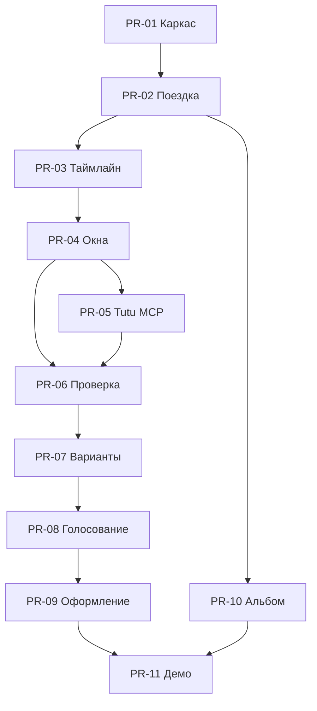

# Tutu Окно — план разработки по фичам и Pull Request'ам

## 1. Цель MVP

**Tutu Окно** — приложение для координации группы внутри уже начавшейся или запланированной поездки.

Основной пользовательский сценарий:

```text
события поездки
→ свободное окно
→ выполнимые варианты
→ групповое решение
→ повторная проверка
→ переход на Туту
→ добавление в общий таймлайн
```

Ключевая ценность продукта — не генерация рекомендаций сама по себе, а проверяемая цепочка:

> свободное окно группы → выполнимый вариант → консенсус → оформление

## 2. Технические ограничения MVP

- Авторизация не используется.
- Деплой не требуется.
- Приложение запускается локально.
- Участник выбирает имя и цвет аватара.
- `participantId` сохраняется в `localStorage`.
- Данные приложения хранятся локально в SQLite.
- Tutu MCP вызывается только с серверной стороны.
- Для демонстрации обязательно существует mock-режим.
- Ручное добавление событий, билетов и отелей является обязательной функцией.

## 3. Рекомендуемый стек

| Зона | Технология | Назначение |
| --- | --- | --- |
| Клиент и сервер | Next.js + TypeScript | Интерфейс, API и серверные интеграции в одном проекте |
| UI | Tailwind CSS + shadcn/ui | Быстрая реализация дизайн-системы в стилистике Туту |
| Локальная база | SQLite + Drizzle ORM | Поездки, события, предложения и голоса |
| Интеграция Туту | MCP TypeScript SDK | Поиск билетов и отелей |
| Состояние запросов | TanStack Query | Запросы, кэширование и повторная проверка вариантов |
| Валидация | Zod | Проверка форм, моделей и ответов интеграций |
| Даты и часовые пояса | Luxon | Расчёт времени, дедлайнов и буферов |
| Тестирование | Vitest + Playwright | Тесты бизнес-логики и сквозного сценария |

## 4. Приоритеты

### P0 — основной демонстрационный сценарий

- Таймлайн поездки.
- Ручное добавление событий.
- Определение свободного окна.
- Указание начальной и следующей обязательной точки.
- Получение вариантов через Tutu MCP.
- Проверка выполнимости.
- Добавление пользовательского варианта.
- Голосование.
- Повторная проверка цены и наличия.
- Переход на Туту.

### P1 — общий фотоальбом

- Загрузка фотографий.
- Общая галерея поездки.
- Фильтрация по участникам и событиям.

### P2 — дополнительные функции

- Генерация PDF-альбома.
- Генерация видеоклипа.
- AI-отбор лучших фотографий.
- Импорт внешних календарей.
- Автоматическое распознавание билетов.
- Подбор вещей для поездки.

## 5. План Pull Request'ов

| PR | Содержание | Демонстрируемый результат |
| --- | --- | --- |
| PR-01 | Каркас проекта и дизайн-система | Все основные экраны доступны по маршрутам |
| PR-02 | Поездка и участники | Можно создать поездку и добавить участников |
| PR-03 | Таймлайн и ручные события | Билеты, отели и мероприятия отображаются в календаре |
| PR-04 | Поиск свободного окна | Система находит промежутки между обязательными событиями |
| PR-05 | Интеграция Tutu MCP | Приложение получает транспортные варианты |
| PR-06 | Feasibility Engine | Система определяет, выполним ли каждый вариант |
| PR-07 | Предложения | Группа видит 3–5 вариантов и может добавить свой |
| PR-08 | Голосование | Участники выбирают вариант через «Да / Возможно / Вето» |
| PR-09 | Повторная проверка и оформление | Победитель проверяется повторно и ведёт на Туту |
| PR-10 | Общий фотоальбом | Участники загружают фотографии в общую галерею |
| PR-11 | Деморежим и стабилизация | Работает полный заранее подготовленный сценарий |

---

## PR-01 — каркас приложения и дизайн-система

### Фичи

- Инициализация Next.js-проекта с TypeScript.
- Подключение Tailwind CSS.
- Подключение базовых компонентов shadcn/ui.
- Создание цветовых и типографических токенов.
- Мобильный layout шириной 390–430 px.
- Нижняя навигация:
  - «Сегодня»;
  - «Решения»;
  - «Альбом».
- Заглушки всех основных экранов.
- Переключатель mock-режима.

### Маршруты

```text
/trip
/trip/timeline
/window/:windowId
/window/:windowId/proposals
/proposal/:proposalId
/vote/:windowId
/booking/:proposalId
/album
```

### Критерии готовности

- Все маршруты открываются без ошибок.
- По экранному сценарию можно пройти кликами.
- Интерфейс корректно отображается на мобильной ширине.
- Компоненты используют общие дизайн-токены.

---

## PR-02 — поездка и участники без авторизации

### Фичи

- Создание поездки:
  - название;
  - город;
  - даты.
- Выбор имени участника.
- Выбор цвета или готового аватара.
- Сохранение `participantId` в `localStorage`.
- Добавление участников в поездку.
- Просмотр состава группы.
- Копирование локальной ссылки на поездку.
- Предзаполненная демо-поездка.

### Модель данных

```ts
type Trip = {
  id: string;
  title: string;
  city: string;
  startsAt: string;
  endsAt: string;
};

type Participant = {
  id: string;
  tripId: string;
  name: string;
  avatarColor: string;
};
```

### Критерии готовности

- Можно создать поездку.
- Можно добавить минимум пять участников.
- После перезагрузки браузер помнит выбранного участника.
- Интерфейс не создаёт впечатление защищённой авторизации.

---

## PR-03 — таймлайн и ручной режим

### Фичи

- Общий календарь поездки.
- Просмотр событий по дням.
- Создание события вручную:
  - билет;
  - отель;
  - мероприятие;
  - встреча;
  - произвольное событие.
- Редактирование события.
- Удаление события.
- Отметка обязательного события.
- Отображение источника события:
  - добавлено вручную;
  - найдено через Туту.

### Поля события

```ts
type TimelineEvent = {
  id: string;
  tripId: string;
  type: "transport" | "hotel" | "activity" | "meeting" | "custom";
  title: string;
  startsAt: string;
  endsAt: string;
  placeName?: string;
  address?: string;
  isRequired: boolean;
  source: "manual" | "tutu";
  sourceUrl?: string;
  comment?: string;
};
```

### Критерии готовности

Можно вручную создать следующий таймлайн:

```text
08:00 — выезд из отеля
19:00 — концерт
```

Оба события отображаются как обязательные точки дня.

---

## PR-04 — свободные окна и точки маршрута

### Фичи

- Автоматический поиск промежутков между обязательными событиями.
- Выбор свободного окна.
- Определение:
  - начальной точки;
  - времени старта;
  - следующей обязательной точки;
  - крайнего времени возвращения.
- Ручное изменение начальной и конечной точки.
- Настройки группы:
  - количество участников;
  - бюджет на человека;
  - минимальный буфер;
  - максимальное время в дороге;
  - допустимость ночного переезда.

### Основная функция

```ts
function findFreeWindows(
  events: TimelineEvent[],
  tripRange: { startsAt: string; endsAt: string }
): FreeWindow[];
```

### Критерии готовности

Для событий в 08:00 и 19:00 при буфере 60 минут система создаёт окно:

```text
08:00–18:00
буфер до концерта: 60 минут
```

---

## PR-05 — интеграция Tutu MCP

### Фичи

- Серверный MCP-клиент.
- Подключение к удалённому Tutu MCP.
- Получение доступных MCP-инструментов.
- Поиск:
  - поездов;
  - автобусов;
  - авиабилетов;
  - отелей.
- Приведение ответов к единой внутренней модели.
- Сохранение снимка результата поиска.
- Mock-режим на случай недоступности интеграции.

### Единая модель варианта

```ts
type TravelOption = {
  id: string;
  type: "train" | "bus" | "flight" | "hotel";
  origin: string;
  destination: string;
  departureAt: string;
  arrivalAt: string;
  returnDepartureAt?: string;
  returnArrivalAt?: string;
  pricePerPerson: number;
  availableSeats?: number;
  bookingUrl?: string;
  source: "tutu" | "mock";
  checkedAt: string;
};
```

### Архитектурное правило

```text
Tutu MCP → MCP adapter → TravelOption → UI
```

Frontend не зависит от структуры MCP-ответов.

### Критерии готовности

- Реальный и mock-адаптеры возвращают одинаковую модель.
- Ошибка MCP не ломает пользовательский сценарий.
- Время последней проверки сохраняется.

---

## PR-06 — Feasibility Engine

Feasibility Engine — техническое ядро продукта.

### Проверки

- Успевает ли группа доехать до выбранной точки.
- Успевает ли группа вернуться.
- Соблюдён ли обязательный буфер.
- Укладывается ли стоимость в бюджет.
- Хватает ли мест, если источник сообщает количество.
- Сколько остаётся полезного времени на месте.
- Не занимает ли дорога слишком большую часть окна.

### Результат проверки

```ts
type FeasibilityResult = {
  status: "verified" | "partial" | "impossible";
  usefulMinutes: number;
  returnBufferMinutes: number;
  pricePerPerson: number;
  availability: "confirmed" | "unknown" | "unavailable";
  passedRules: string[];
  failedRules: string[];
};
```

### Основное условие

```text
eligible = return_before_deadline
        && group_total_within_limits
        && inventory_sufficient_if_reported
        && useful_time_above_minimum
        && all_machine_checkable_constraints_pass
```

### Статусы интерфейса

- **Проверено** — все обязательные данные подтверждены.
- **Нужна проверка** — часть данных отсутствует, например количество мест.
- **Не подходит** — нарушено хотя бы одно жёсткое условие.

### Обязательные тесты

- Возвращение ровно к deadline.
- Недостаточный буфер.
- Превышение бюджета.
- Неизвестное количество мест.
- Недостаточное количество мест.
- Слишком мало времени на месте.
- Изменившаяся цена.
- Отсутствующий обратный маршрут.

---

## PR-07 — предложения

### Фичи

- Выдача 3–5 лучших вариантов.
- Карточка варианта:
  - направление;
  - дорога туда и обратно;
  - полезное время;
  - цена на человека;
  - доступность;
  - буфер;
  - статус проверки;
  - причина рекомендации.
- Сортировка по итоговой оценке.
- Добавление собственного предложения.
- Вставка внешней ссылки.
- Ручной вариант без ссылки.
- Одинаковая проверка системных и пользовательских предложений.

### Скоринг

```text
40% — удовлетворённость участника с худшим fit
30% — средняя удовлетворённость группы
20% — полезное время относительно времени в дороге
10% — цена и ценность
```

### Критерии готовности

- Невыполнимые варианты не участвуют в основном голосовании.
- Частично проверенные варианты имеют понятное предупреждение.
- Пользовательский вариант проходит те же проверки, что и системный.

---

## PR-08 — голосование

### Фичи

- Варианты ответа:
  - «Да»;
  - «Возможно»;
  - «Вето».
- Один голос участника на вариант.
- Возможность изменить голос.
- Таймер голосования.
- Прогресс участия.
- Автоматический выбор победителя.
- Вето исключает вариант.
- При ничьей система оставляет два финальных варианта.
- Бюджетные ограничения участников не показываются другим участникам.

### Синхронизация для MVP

```text
GET /api/trips/:tripId/votes каждые 2 секунды
```

WebSocket или внешний realtime-сервис для MVP не требуются.

### Критерии готовности

- Две вкладки браузера с разными `participantId` видят изменения голосования.
- Участник может изменить решение до завершения таймера.
- Вариант с вето не становится победителем.

---

## PR-09 — повторная проверка и оформление

### Фичи

- Повторный запрос к Tutu MCP.
- Сравнение:
  - цены;
  - расписания;
  - доступности;
  - количества мест.
- Статусы:
  - «Ничего не изменилось»;
  - «Цена изменилась»;
  - «Мест недостаточно»;
  - «Вариант больше недоступен».
- Deeplink на оформление в Туту.
- Кнопка «Уже купили — добавить вручную».
- Добавление подтверждённой поездки в таймлайн.
- Короткое переголосование при существенном изменении.

### Принцип

```text
проверка → переход на Туту → ручное подтверждение → событие в таймлайне
```

Система не должна автоматически сообщать, что покупка совершена, если она не получила подтверждение.

### Критерии готовности

- Перед переходом на Туту данные обновляются.
- Изменение цены явно показывается пользователю.
- Исчезнувший вариант не заменяется автоматически и незаметно.

---

## PR-10 — общий фотоальбом

### Фичи

- Загрузка нескольких фотографий.
- Привязка автора.
- Привязка фотографии к дню или событию.
- Общая галерея поездки.
- Фильтр по участнику.
- Фильтр по дню.
- Полноэкранный просмотр.
- Скачивание оригинала.

### Локальное хранение

```text
data/uploads/{tripId}/{photoId}.jpg
```

Метаданные фотографий хранятся в SQLite.

### Не входит в первый PR альбома

- Распознавание лиц.
- AI-отбор фотографий.
- Генерация видео.
- Синхронизация с внешними облачными галереями.
- Генерация PDF.

### Критерии готовности

- Фотография после загрузки появляется у всех участников поездки.
- Галерея не теряется после перезапуска локального сервера.
- Можно определить автора каждой фотографии.

---

## PR-11 — деморежим и стабилизация

### Предзаполненный сценарий

- Поездка в Петербург.
- Пять участников.
- Отель утром.
- Концерт в 19:00.
- Свободное окно 08:00–18:00.
- Буфер 60 минут.
- Вариант «Выборг на день».
- Вариант «Петергоф».
- Подготовленные mock-ответы Tutu.
- Подготовленные фотографии для альбома.

### Фичи

- Кнопка «Запустить демо».
- Сброс демо-данных.
- Loading-состояния.
- Empty-состояния.
- Обработка ошибок интеграций.
- Отображение времени последней проверки.
- Playwright-тест полного пользовательского сценария.

### Сквозной критерий готовности

Пользователь может без ручного изменения базы пройти путь:

```text
поездка
→ свободное окно
→ выбор начальной и конечной точки
→ варианты
→ проверка Выборга
→ голосование
→ повторная проверка
→ переход на Туту
→ добавление события
→ фотографии в общем альбоме
```

## 6. Зависимости Pull Request'ов



## 7. Распределение на трёх разработчиков

### Разработчик 1 — интерфейс

- PR-01.
- UI для PR-03.
- UI для PR-07.
- UI для PR-08.
- UI для PR-09.

### Разработчик 2 — данные и бизнес-логика

- PR-02.
- PR-03: модели и API.
- PR-04.
- PR-06.
- SQLite и Drizzle.

### Разработчик 3 — интеграции

- PR-05.
- Синхронизация голосования в PR-08.
- PR-10.
- Mock-режим и фикстуры.

## 8. Возможная параллельная работа

После завершения PR-02:

- Разработчик 1 начинает интерфейс таймлайна и карточек.
- Разработчик 2 реализует поиск окон и Feasibility Engine.
- Разработчик 3 реализует Tutu MCP adapter и mock-ответы.

После объединения PR-05 и PR-06:

- подключаются реальные варианты;
- реализуется голосование;
- добавляется повторная проверка;
- параллельно собирается фотоальбом.

## 9. Точка отсечения

Если времени не хватает, полностью реализуются **PR-01–PR-09**.

PR-10 можно показать как интерфейс с заранее подготовленными фотографиями, а PR-11 ограничить стабильным mock-сценарием.

Основной wow-эффект продукта:

```text
окно → выполнимый вариант → групповое решение → Туту
```

Фотоальбом усиливает эмоциональный финал, но не должен мешать завершению основной цепочки.

## 10. Definition of Done для каждого PR

- Изменения соответствуют одной продуктовой задаче.
- Нет неиспользуемых компонентов и временного кода без пометки.
- Новая бизнес-логика покрыта unit-тестами.
- Для нового экрана предусмотрены loading-, empty- и error-состояния.
- TypeScript проходит без ошибок.
- Основной сценарий не ломается.
- Mock-режим продолжает работать без Tutu MCP.
- В описании PR указано, как проверить результат вручную.
