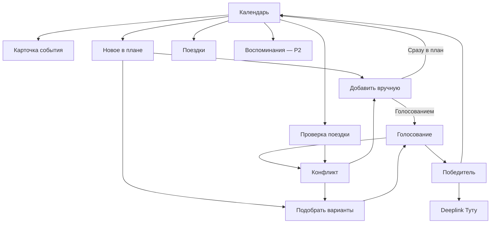

# Tutu Окно — передача прототипа в разработку

**Версия handoff:** 1.0  
**Дата:** 19 августа 2026  
**Зафиксированный UI-срез:** `0.3.0`  
**Назначение:** дать разработчику достаточно контекста для декомпозиции, оценки и реализации без додумывания поведения по статичному макету.

## 0. Что передаём

| Файл | Роль |
|---|---|
| `tutu-okno-prototype-v0.3.html` | Зафиксированный кликабельный storyboard из 11 экранов |
| `tutu-okno-ui-presets.json` | Машиночитаемый каталог экранов, состояний и переходов |
| `Tutu_Okno_business_analysis.md` | Продуктовая гипотеза, рынок, конкуренты, ограничения MCP и граница MVP |
| `Tutu_Okno_developer_handoff.md` | Источник решений для планирования разработки |

При конфликте документов приоритет такой:

1. бизнес-границы и честность обещаний — `Tutu_Okno_business_analysis.md`;
2. поведение и scope реализации — этот handoff;
3. внешний вид и последовательность экранов — прототип;
4. JSON — точные идентификаторы состояний для задач, тестов и аналитики.

## 1. Что это за продукт

**Tutu Окно** помогает группе заполнить свободный слот в поездке: найти выполнимые варианты, согласовать один, перепроверить логистику и перейти к оформлению через Туту.

Основная сущность — **групповое свободное окно**, а не полный AI-маршрут.

Основной сценарий:

```text
свободное окно
→ ручной вариант или подбор 3–5 вариантов
→ проверка дороги, бюджета, мест и буфера
→ голосование За / Можно / Не могу
→ повторная проверка победителя
→ deeplink Туту
→ событие в общем плане
```

Демо-сценарий: четыре человека находятся в Казани, у них свободно `12:20–18:10`, вечером обязательный ужин, затем поезд. Сервис предлагает варианты и показывает, куда группа успеет без разрушения дальнейшего плана.

## 2. Зафиксированные UX-решения

- Приложение mobile-first; базовый макет — 390 px.
- Главный экран — недельный календарь.
- Нижняя навигация: `Добавить` → `Календарь` → `Воспоминания`.
- Верхние 11 вкладок в HTML нужны только для показа состояний. В продукте их нет.
- В шапке календаря: текущая поездка, профиль, фильтр участников и кнопка `Проверить`.
- Событие открывается компактной карточкой: время, место, маршрут, участники, билеты и фото.
- Создание начинается с вопроса: добавить известный вариант вручную или получить подбор.
- Участники выбираются multiselect-списком.
- `Только я` — пресет: остаётся текущий пользователь, голосование отключается, событие идёт сразу в личный план.
- Групповой вариант можно добавить напрямую или вынести на голосование; права на прямое добавление нужно зафиксировать отдельно.
- UI-значения голоса: `За`, `Можно`, `Не могу`; доменные значения: `yes`, `maybe`, `veto`.
- Логистика проверяется до публикации, при изменении входных данных и ещё раз перед бронированием.
- Конфликт обозначается и цветом, и иконкой/текстом. Постоянного мигания нет.
- `Проверить` сканирует поездку, затем открывает отчёт. Сервис ничего не переставляет без подтверждения.
- В разделе поездок одна точка входа: поле `Вступить по ссылке или коду` и кнопка `Вступить`.
- Фото и генерация воспоминаний остаются показанным future-сценарием, но не входят в core MVP.

## 3. Карта экранов

| ID | Экран | Задача | MVP |
|---|---|---|---:|
| `calendar` | Неделя | Увидеть план, gaps, голосования, конфликты и запустить проверку | P0 |
| `event` | Событие | Посмотреть детали события, маршрут и вложения | P0 |
| `create` | Способ создания | Выбрать ручной ввод или подбор | P0 |
| `manual` | Ручное создание | Указать событие, участников и способ добавления | P0 |
| `ideas` | Подбор | Выбрать выполнимые варианты для окна | P0 |
| `vote` | Голосование | Ответить по вариантам и завершить выбор | P0 |
| `conflict` | Конфликт | Понять причину и выбрать исправление | P0 |
| `winner` | Победитель | Перепроверить вариант и перейти к оформлению | P0 |
| `audit` | Проверка поездки | Увидеть конфликты и предложенные переезды | P1; P0 для демо |
| `trips` | Профиль и поездки | Создать/открыть поездку, войти по коду, увидеть архив | P0 без архива; архив P1 |
| `memories` | Воспоминания | Разложить фото и создать медиачерновик | P2 |



## 4. UI-пресеты

Под «пресетом» понимается воспроизводимое состояние экрана с известными входными данными, доступными действиями и ожидаемым следующим состоянием. Полный каталог хранится в `tutu-okno-ui-presets.json`.

Ключевые пресеты:

| Preset ID | Что проверяет |
|---|---|
| `calendar.default` | Недельный план, свободное окно и конфликтное голосование |
| `calendar.checking` | Блокировку CTA и одноразовый scan-переход |
| `calendar.checked_with_issues` | Переход к отчёту после найденных замечаний |
| `manual.group_vote` | Групповое событие с голосованием |
| `manual.group_direct` | Групповое событие без голосования |
| `manual.only_me` | Личный пресет, принудительно прямое добавление |
| `manual.no_participants` | Валидацию пустого выбора |
| `ideas.two_selected` | Выбор карточек и счётчик вариантов |
| `vote.active` | Один ответ на каждый вариант и смену ответа |
| `conflict.schedule_changed` | Объяснимый конфликт после изменения расписания |
| `winner.rechecked` | Повторную проверку цены и мест перед deeplink |
| `audit.issues_found` | Итог общей проверки без автоперестройки плана |
| `memories.draft_ready` | Future-сценарий медиачерновика |

Для Storybook/тестов рекомендуется сохранить эти ID без переименования.

## 5. Состояния бизнес-сущностей

```text
PlanItem
draft → proposed → voting → selected → booking → confirmed
                    ↘ conflicted
booking → price_changed | sold_out | booking_failed

LogisticsCheck
unknown → checking → valid | warning | blocking
valid | warning | blocking → stale  при изменении времени, маршрута, цены или состава группы

Poll
draft → active → closed | expired | cancelled
active → conflicted → active | closed

MemoryDraft — P2
collecting → matching → needs_review → generating → ready | failed
```

Календарный элемент должен иметь отдельные поля `type` и `status`. Нельзя кодировать всё одним enum: билет может быть `type=booking`, `status=confirmed`, а голосование — `type=poll`, `status=conflicted`.

## 6. Минимальная модель данных

### `Trip`

```ts
type Trip = {
  id: string;
  title: string;
  timezone: string;
  startsAt: string;
  endsAt: string;
  ownerId: string;
  participantIds: string[];
  inviteCode: string;
  status: "active" | "archived";
};
```

### `Participant` и приватные ограничения

```ts
type Participant = {
  id: string;
  displayName: string;
  avatarUrl?: string;
  role: "owner" | "member";
};

type ConstraintProfile = {
  tripId: string;
  participantId: string;
  maxBudgetPerPerson?: number;
  maxTravelMinutes?: number;
  allowOvernight?: boolean;
  returnBufferMinutes: number;
  interests: string[];
  notes?: string;
};
```

Бюджет и чувствительные ограничения доступны системе и самому участнику, но не раскрываются группе числом.

### `CalendarItem` и `Gap`

```ts
type CalendarItem = {
  id: string;
  tripId: string;
  type: "booking" | "event" | "transfer" | "poll" | "draft";
  status: "draft" | "active" | "conflicted" | "confirmed" | "cancelled";
  title: string;
  startsAt: string;
  endsAt: string;
  location?: { name: string; lat?: number; lon?: number; mapUrl?: string };
  participantIds: string[];
  source: "manual" | "tutu" | "demo_catalog" | "external";
  externalRef?: string;
};

type Gap = {
  id: string;
  tripId: string;
  startsAt: string;
  endsAt: string;
  participantIds: string[];
  previousItemId?: string;
  nextRequiredItemId?: string;
};
```

### `Candidate` и проверка

```ts
type Candidate = {
  id: string;
  gapId: string;
  title: string;
  source: "tutu" | "demo_catalog" | "user_link";
  startsAt: string;
  endsAt: string;
  travelMinutes: number;
  usefulMinutes: number;
  pricePerPerson?: number;
  groupPrice?: number;
  capacity: number | "unknown";
  returnBufferMinutes: number;
  deeplink?: string;
  check: FeasibilityCheck;
};

type FeasibilityCheck = {
  status: "unknown" | "checking" | "valid" | "warning" | "blocking" | "stale";
  reasons: Array<{ code: string; message: string }>;
  checkedAt?: string;
  inputsHash?: string;
};
```

### `Poll`

```ts
type Poll = {
  id: string;
  gapId: string;
  candidateIds: string[];
  deadline: string;
  status: "draft" | "active" | "conflicted" | "closed" | "expired" | "cancelled";
  createdBy: string;
};

type VoteResponse = {
  pollId: string;
  candidateId: string;
  participantId: string;
  value: "yes" | "maybe" | "veto";
  updatedAt: string;
};
```

Ответ участника уникален по `(pollId, candidateId, participantId)` и может изменяться до закрытия голосования.

## 7. Предлагаемые интерфейсы фронта и сервера

Это направления контрактов, а не утверждённые URL:

| Операция | Минимальный результат |
|---|---|
| Получить поездку и план | поездка, участники, элементы календаря, ревизия данных |
| Создать/вступить в поездку | `tripId`, роль, invite code/link |
| Создать gap | границы окна, состав участников, соседние обязательные события |
| Найти варианты | 3–5 `Candidate` с источником и `FeasibilityCheck` |
| Проверить вариант | статус, причины, цена, capacity/unknown, timestamp |
| Создать голосование | poll, варианты, дедлайн |
| Отдать/изменить голос | актуальная агрегированная версия poll |
| Завершить голосование | победитель либо явная причина отсутствия победителя |
| Перепроверить победителя | новая цена/места/логистика и `stale`-обработка |
| Получить аудит поездки | конфликты и предлагаемые черновики переездов |
| Экспортировать | deeplink Туту и `.ics` |

MCP Туту вызывается с сервера приложения, с таймаутом, кешем и контролируемым повтором. Браузер не должен обращаться к MCP напрямую.

## 8. Что умеет и чего не умеет текущий прототип

### Реально интерактивно

- переходы между 11 экранами;
- локальный выбор фильтра участника;
- scan-состояние проверки и переход в audit;
- multiselect участников и `Только я`;
- режим `Сразу в план / Голосованием`;
- выбор карточек рекомендаций и счётчик;
- один локальный ответ на вариант голосования;
- выбор формата воспоминания;
- локальные success-состояния добавления переездов и медиачерновика.

### Заглушки

- фильтр не меняет события календаря;
- данные формы не создают реальный объект;
- карточки подбора не пересчитываются;
- голоса не меняют агрегаты и победителя;
- победитель всегда Иннополис;
- обычные события открывают одну и ту же карточку;
- карта, маршрут, билет, бронирование, создание/вход в поездку и архив не подключены;
- после `Закрепить` или `Добавить переезды` календарь не меняется;
- фото не загружаются и не сопоставляются;
- состояние хранится только в DOM и сбрасывается после перезагрузки.

Следствие: HTML оценивается как storyboard поведения, а не как готовый frontend или модель архитектуры.

## 9. Граница MVP

### Хакатонный vertical slice

1. Одна поездка и четыре тестовых участника.
2. Недельный календарь и одно найденное/ручное окно.
3. Ручной вариант плюс 2–3 варианта через MCP Туту.
4. Для activity без supply — только явно подписанный `демо-каталог`.
5. Проверка дороги туда/обратно, полезного времени и буфера.
6. Голосование из нескольких сессий либо честно обозначенная симуляция остальных участников.
7. Возникновение одного объяснимого конфликта.
8. Повторная проверка победителя.
9. Deeplink Туту и добавление результата в план.

### Production pilot

- вход по ссылке/коду;
- роли owner/member;
- приватные бюджеты и машинно проверяемые ограничения;
- серверное хранение и синхронизация голосов;
- статус capacity `number | unknown`;
- повторная проверка цены и мест;
- `.ics`;
- loading, empty, offline и error-состояния;
- идемпотентные команды и сохранение после перезагрузки.

### После доказательства ядра

- импорт free/busy из внешних календарей;
- push-уведомления;
- split payment и удержание мест;
- полноценный каталог ресторанов/экскурсий;
- автоальбом/ролик;
- packing list и товары маркетплейсов.

## 10. Декомпозиция для оценки

| Эпик | Scope | Размер | Зависимости |
|---|---|---:|---|
| App shell и навигация | роутинг, layout, состояния загрузки | S | дизайн-токены |
| Поездка и группа | create/join, роли, invite | M | auth/backend |
| Календарь | неделя, типы событий, gaps, фильтр | M | модель плана |
| Карточка события | детали, вложения, ссылки | S | календарь |
| Ручное создание | форма, участники, direct/vote | M | права, validation |
| Подбор | запрос, 3–5 карточек, выбор | L | MCP, feasibility |
| Feasibility engine | дорога, буфер, бюджет, capacity/unknown | L | геоданные, MCP |
| Голосование | ответы, дедлайн, кворум, realtime | L | backend, правила |
| Конфликт и recheck | stale, объяснение, альтернативы | M | feasibility |
| Победитель и оформление | результат, deeplink, `.ics` | M | MCP, booking policy |
| Аудит поездки | проверка плана, черновики переездов | M | calendar + feasibility |
| Профиль/архив | список поездок и документов | M | backend |
| Воспоминания | upload, EXIF, matching, generation | L | media storage; P2 |

`S/M/L` — относительный размер для планирования, не оценка по дням.

Рекомендуемый порядок:

```text
fixtures и доменная модель
→ app shell и календарь
→ ручное создание
→ feasibility на mock-данных
→ голосование
→ MCP Туту
→ recheck, победитель и deeplink
→ совместные сессии
→ join/profile
→ audit
→ memories
```

Фронт стоит строить поверх интерфейса репозитория данных с mock-реализацией. Тогда UI, backend и MCP можно разрабатывать параллельно.

### Связка PR с дизайном приложения

Подробный PR-план хранится в `Tutu MCP Plan.md`. Каждый PR с UI должен ссылаться на screen ID из раздела 3 и preset ID из `tutu-okno-ui-presets.json`.

| PR | Дизайн-поверхность | Preset ID |
|---|---|---|
| PR-01 | shell: `calendar`, `create`, `memories`, `trips`; нижняя навигация `Добавить / Календарь / Воспоминания` | `calendar.default` |
| PR-02 | `trips`, шапка `calendar`, фильтр участников | `calendar.default` |
| PR-03 | `calendar`, `event` | `calendar.default`, `event.confirmed` |
| PR-04 | `create`, `manual` | `create.gap_selected`, `manual.group_vote`, `manual.group_direct`, `manual.only_me`, `manual.no_participants` |
| PR-05 | data layer для `ideas` | `ideas.two_selected` |
| PR-06 | data layer для `ideas`, `conflict`, `audit` | `conflict.schedule_changed`, `audit.issues_found` |
| PR-07 | `ideas` | `ideas.two_selected` |
| PR-08 | `vote`, конфликтный элемент на `calendar` | `vote.active`, `calendar.default` |
| PR-09 | `winner`, обновление `calendar` после ручного подтверждения | `winner.rechecked`, `calendar.checked_with_issues` |
| PR-10 | `audit`, полный P0 demo-flow | `calendar.checking`, `audit.issues_found` |
| PR-11 | `memories`, P2 future-сценарий | `memories.draft_ready` |

## 11. Критерии готовности core-сценария

Core-сценарий готов, если четыре участника могут:

1. открыть одну поездку или войти в неё по коду;
2. увидеть один и тот же план в своём часовом поясе поездки;
3. выбрать свободное окно;
4. создать ручной вариант и получить минимум два live-варианта;
5. увидеть для каждого варианта цену, дорогу, полезное время, буфер и статус мест;
6. проголосовать из разных сессий и изменить ответ до закрытия;
7. увидеть конфликт на календаре и открыть его причину;
8. завершить голосование по зафиксированному правилу;
9. повторно проверить победителя;
10. перейти по deeplink Туту;
11. увидеть созданный элемент в общем плане после обновления страницы.

Общие требования:

- `loading`, `empty`, `error`, `offline` и `stale` не смешиваются;
- повторный tap/callback не создаёт дубликат;
- приватный бюджет не раскрывается другим участникам;
- время считается в timezone поездки;
- невозможный вариант не называется проверенным;
- сервис не сообщает `доступно N мест`, если источник этого не вернул;
- изменение цены/мест после голосования не подменяется молча;
- конфликт объясняется конкретными временами и требуемым буфером;
- без подтверждения пользователя план не перестраивается.

## 12. Решения, которые нужны до точной оценки

Разработчик не должен угадывать:

1. Может ли одна группа иметь несколько поездок и кто владелец плана.
2. Фильтр участника скрывает события, подсвечивает их или пересчитывает общий gap.
3. Чем ручной выбор только себя отличается от пресета `Только я`.
4. Кто вправе добавить групповое событие без голосования.
5. Правила голосования: кворум, вето, ничья, дедлайн, досрочное завершение.
6. Что происходит с голосами при появлении конфликта.
7. `warning` допускает публикацию или требует подтверждения; `blocking` должен запрещать.
8. Кто покупает билеты: организатор за всех или каждый за себя.
9. Когда событие считается confirmed: после deeplink, оплаты, callback или ручного подтверждения.
10. Какой routing/геокодер используется для нетранспортных точек.
11. Какие переезды создаются автоматически, а какие только как черновики.
12. Нужна ли синхронизация с внешним календарём в пилоте или достаточно `.ics`.

Рекомендуемый default для хакатона: owner завершает голосование; veto блокирует вариант; ничья решается худшим individual fit, затем полезным временем, затем ценой; `blocking` нельзя оформить; покупку делает каждый по deeplink; подтверждение брони в демо отмечается вручную.

## 13. Edge cases для бэклога

- общего окна нет;
- никто не выбран;
- участник вышел из поездки во время голосования;
- дедлайн прошёл, но кворума нет;
- ничья или все варианты получили veto;
- вариант устарел, цена выросла или мест меньше участников;
- capacity отсутствует в ответе;
- изменилось следующее обязательное событие;
- конфликт появился после голосов;
- пользователь ушёл с экрана во время проверки;
- сеть пропала во время голоса/recheck;
- команда отправилась повторно;
- deeplink не открылся;
- внешнее время пришло без timezone;
- у фото нет EXIF, геолокация запрещена или timestamp неверен;
- участник не дал согласие на использование фото.

## 14. Визуальные токены текущего прототипа

Это токены прототипа, восстановленные по публичному стилю Туту. Они **не заменяют официальный Artbook 2.2**.

| Token | Значение | Назначение |
|---|---|---|
| `ink` | `#0D0B68` | основной текст и тёмные поверхности |
| `purple` | `#6F5DF6` | primary и активные состояния |
| `purpleDark` | `#5545CA` | pressed/strong accent |
| `yellow` | `#D1FF1A` | энергичный акцент и CTA-контраст |
| `cyan` | `#6DD8DF` | вторичный акцент |
| `lime` | `#B9EF54` | позитивный/AI-акцент |
| `coral` | `#FF776D` | конфликт и blocking |
| `green` | `#168568` | успешно проверено |
| `page` | `#F2F3F7` | фон плотного экрана |
| `surface` | `#FFFFFF` | карточки и sheets |

- Шрифт прототипа: `Inter`, затем системный sans-serif.
- Используется один rounded outline-набор иконок.
- Статус нельзя передавать только цветом: нужен текст и/или иконка.
- Анимации одноразовые, короткие и отключаются при `prefers-reduced-motion`.
- В production значения должны быть перенесены в семантические токены дизайн-системы, а не размножены как HEX.

## 15. Definition of handoff done

- Зафиксированный HTML открывается автономно.
- Все 11 demo-вкладок переключаются.
- Основные интеракции из раздела 8 работают без сети.
- Preset ID из JSON используются в stories/tests.
- Product owner принял решения из раздела 12 либо они оформлены отдельными spikes.
- Разработчик оценивает сущности и сценарии, а не количество нарисованных экранов.
- Фото помечено P2 и не размывает core MVP.
- Нет обещаний о live availability для ресторанов, событий и экскурсий без внешнего supply.
